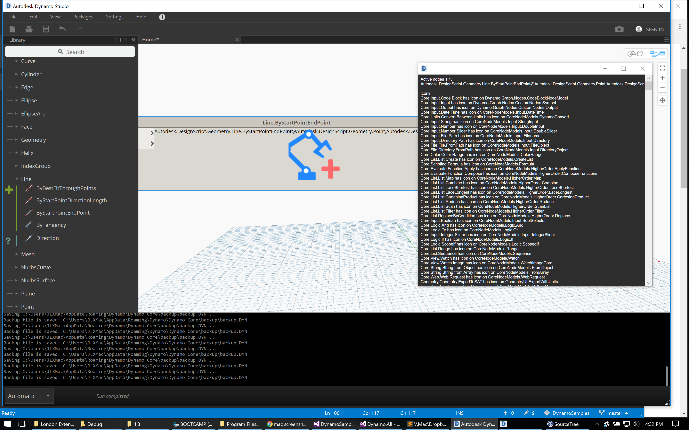

# View-Icons-Dynamo-Extension

This is a stub for a DynamoBIM View Extension to display icons on Nodes.

Still WIP, project needs tons of cleanup, and figuring out how to find the native icon for each node. Hopefully someone can give a hand! :)

This project started at the Dynamo Extensions workshop at Grimshaw London, Feb 2018, led by Racel Williams and Michael Kirschner. Forked from DynamoSamples.